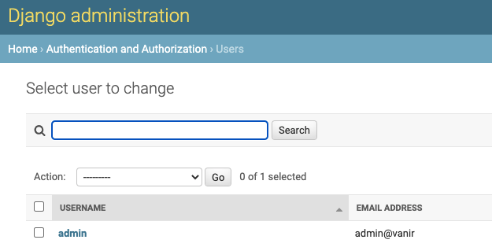

# Vanir
[](https://opensource.org/licenses/Apache-2.0)
[](https://www.python.org/downloads/release/python-390/)
[](https://docs.djangoproject.com/en/3.2/)
[](https://docs.docker.com/compose/gettingstarted/)
[](https://codecov.io/gh/guanana/vanir)

Crypto asset management and bot control, all one place


**This software comes without any warranty, “AS IS”.**

## Table of Contents
* [About Vanir](#about-vanir)
* [Overview](#overview)
* [Pre-reqs](#pre-reqs)
* [How to start](#how-to-start)
  * [Quick Start Docker](#quick-start-docker)
    * [Easy](#easy)
    * [Custom](#custom-build)
  * [No docker install](#no-docker-install)
    * [Installation](#installation-the-hard-way)
* [Usage](#usage)
  * [Default data](#default-data)
    * [Default username/password](#how-to-change-default-username-and-password)
* [Knowing issues](#knowing-issues)
* [Contribute](#contribute)
  * [Test Coverage](#test-coverage)
* [License](#license)
* [Disclaimer](#disclaimer)

## Data Sources and supported Exchanges
[](https://www.coingecko.com)
[](https://www.binance.com/en)
## About Vanir
Vanir is a Django app aiming to solve the current problems with proprietary
software in the crypto world.

Crypto helps people to have more freedom: from goverments, banks, burocracy,
privacy... It's a shame that when you get into the world of crypto you need
to give away your data to another company in order to keep track of your assets
or automate certain operations.

Vanir tries to fill that gap. This program is completely open source and [free to
use or copy, modified, etc..](#license).

The information you hold in this app will NEVER leave your own computer, everything
is run locally and the program just uses certain API calls in order to perform the
operations asked (ie: refresh asset price, make an order, automatic import of assets, ...)

Feel free to [contribute](https://github.com/guanana/vanir/pulls) or [raise a problem](https://github.com/guanana/vanir/issues)
if you do so, try to include as much information as possible so the problem can be reproduced and fixed.

## Overview

Once you deploy Vanir you should see a page like this,
if you do... Congrats! You are ready to start adding your assets

## Pre-reqs
Make sure you installed in your machine Docker-compose, for instructions
please go [here](https://docs.docker.com/compose/install/)

## How to start

### Quick Start Docker

#### Easy
0. You don't need to clone the repo
1. Copy/Download the file [docker-compose.yml](https://github.com/guanana/vanir/blob/main/docker-compose.yml) on your computer
2. Edit the default passwords in the docker-compose.yml **this is for your own extra peace of mind**.
3. Run `docker-compose up -d`
4. Login with user `admin` and password `admin` and **[CHANGE ADMIN PASSWORD](#how-to-change-default-username-and-password)**

#### Custom build
1. Clone the repo: `git clone https://github.com/guanana/vanir.git`
2. Edit the default passwords **this is for your own extra peace of mind**.
_(data is always within your computer so unless you modify the default settings
and expose on purpose your installation, this credentials will only be local to you)_
You can find them in .envs/production-example. Once changed, rename the folder to `.envs/.production`
3. Add the new env path (.envs/.production) on the compose/production.yml file
4. Finally, just run: `docker-compose -f compose/production.yml up -d`
5. Login with user `admin` and password `admin` and **[CHANGE ADMIN PASSWORD](#how-to-change-default-username-and-password)**

### No docker install
#### Installation (the hard way!)
**There's no reason for you to use this option**. It's harder and it will most likely give you headaches and problems,
still I thought I will just mention in case you really feel adventurous.

The recommended way to run the application is with [docker](#quick-start-docker) . It will be easier to maintain,
update and you don't need to worry about installing dependencies in your machine, conflicts
with python versions or any other inconvenient. Still, if you want to deploy this app locally
in your machine you can do it by:

- Clone the repo: `git clone https://github.com/guanana/vanir.git`

- [Install Python 3.9](https://www.python.org/downloads/) and [pip](https://pip.pypa.io/en/stable/installation/)

- Install requirements: `pip install -r requirements/production.txt`

- [Install Postgresql](https://www.postgresql.org/download/) and configure it

- Configure manually all the credentials on Django to connect to Postgresql

- Run Django
```shell
python manage.py migrate
python manage.py runserver 127.0.0.1:80
```


## Usage
The app is designed to grow with plugins through time and contributions. The menu is quite self-explanatory but just for
clarity:

- **Exchange**: Here is where you configure your exchanges. There are certain exchanges
that will allow you to do certain operations (supported) and others that you can add manually
that are just a way for you of keeping track (non-supported/organisational)
- **Token**: Token information and value (ie: ETH, BTC, BNB, SOL, ADA, ...). If you don't use any
supported exchange you'll need to define the tokens here manually.
- **Account**: Configure your account with different exchanges, your API key and keep track
of your assets. You can configure as many as you want.
- **Orders**: Place orders with the supported exchanges.
- **Utils**: Utilities that will make your life easier, like `Binance:Populate Tokens`
- **Plugins**: Different tools that already exists, like `New Coin Bot`

The different components are interlink together. In order to place an order you previously need to have
created a supported _Exchange_, an _Account_ to manage that exchange authentication and assets
and have all your _Tokens_ imported on the app. Don't worry, majority of this tasks are automated with the
supported exchanges ;-)


- **Login**: Create your account and login (username and password) to access the tools, because even if it's local
you may want to protect it from unwanted eyes ;-)
- **Admin**: This is a Django app, and as such you have access to admin interface. *This is a dangerous zone*, there shouldn't
be any need for you to access it, but if you want to investigate access it by login and going to: http://localhost/<admin_url_in_config>/
or just click on the name of your user in the right top corner.

### Default data
The app comes with some really basic data. As soon as you configure a supported exchange you can
auto import all the real data. It's supposed to be just a simple guide and assistance for quick start.

The first time you login the default username and password is `admin`. **PLEASE CHANGE IT!**

#### How to change default username and password
Once login with the default user and password (admin). Click on Admin (right top corner) and click again on admin.


Fill the desired fields and click on Password:

*Raw passwords are not stored, so there is no way to see this user’s
password, but you can change the password using CLICK ME--> __this form__ <-- CLICK ME.*


## Knowing issues
- When using more than one account select same `Token Pair` to avoid constant update
and temporary wrong quantities being displayed. Recommended, Tether
- For now you can add tokens in accounts manually, but you cannot remove them

## Contribute
To start contributing just fork the project and run the local environment by running:
`docker-compose -f local.yml up -d`

### Test coverage
To run the tests, check your test coverage, and generate an HTML coverage report

    $ coverage run -m pytest
    $ coverage html
    $ open htmlcov/index.html


## License
*License: Apache Software License 2.0*

## Disclaimer
THIS SOFTWARE IS PROVIDED BY THE COPYRIGHT HOLDERS AND CONTRIBUTORS “AS IS” AND ANY EXPRESS OR IMPLIED WARRANTIES,
INCLUDING, BUT NOT LIMITED TO, THE IMPLIED WARRANTIES OF MERCHANTABILITY AND FITNESS FOR A PARTICULAR PURPOSE ARE DISCLAIMED.
IN NO EVENT SHALL THE COPYRIGHT OWNER OR CONTRIBUTORS BE LIABLE FOR ANY DIRECT, INDIRECT, INCIDENTAL, SPECIAL, EXEMPLARY,
OR CONSEQUENTIAL DAMAGES (INCLUDING, BUT NOT LIMITED TO, PROCUREMENT OF SUBSTITUTE GOODS OR SERVICES; LOSS OF USE, DATA,
OR PROFITS; OR BUSINESS INTERRUPTION) HOWEVER CAUSED AND ON ANY THEORY OF LIABILITY, WHETHER IN CONTRACT, STRICT LIABILITY,
OR TORT (INCLUDING NEGLIGENCE OR OTHERWISE) ARISING IN ANY WAY OUT OF THE USE OF THIS SOFTWARE,
EVEN IF ADVISED OF THE POSSIBILITY OF SUCH DAMAGE.
